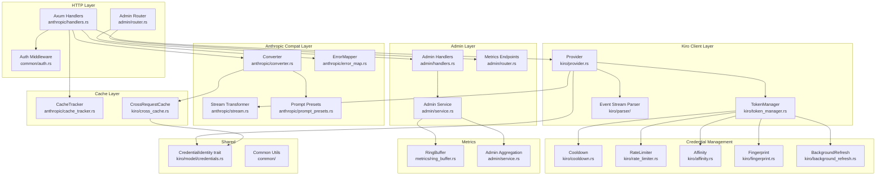
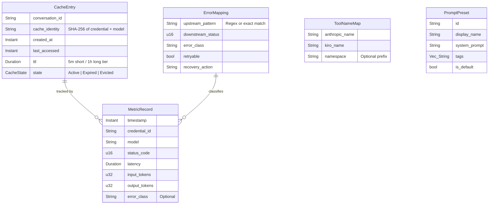

# Architecture Overview — kiro.rs Fusion Blueprint

## 1. System Architecture Style

**Modular monolith** — single-binary Rust service built on Axum 0.8 + Tokio async runtime.

All modules compile into one binary; boundaries are enforced by Rust module visibility
(`pub(crate)`, `pub(super)`) rather than network calls. The admin UI is embedded via
`rust-embed` at compile time. This architecture preserves deployment simplicity while
enabling clear separation of concerns across seven logical layers.

## 2. Component Diagram



## 3. Technology Stack

| Layer | Technology | Version | Purpose |
|-------|-----------|---------|---------|
| Runtime | Tokio | 1.x | Async runtime, task scheduling |
| HTTP Framework | Axum | 0.8 | Request routing, middleware, state extraction |
| HTTP Client | reqwest | 0.12 | Upstream Kiro API calls, per-credential proxy |
| Serialization | serde + serde_json | 1.x | JSON serialization / deserialization |
| Cryptography | subtle | 2.x | Constant-time API key comparison |
| Hashing | sha2 | 0.10 | Domain-separated identity fingerprints |
| Concurrency | parking_lot | 0.12 | Low-contention Mutex / RwLock for cache |
| Image Processing | image | 0.25 | GIF frame extraction, JPEG re-encoding |
| Embedded Assets | rust-embed | 8.x | Admin UI static file embedding |
| Frontend | React 18 + TypeScript + Tailwind | — | Admin dashboard SPA |
| Rust Edition | 2024 | — | Let-chain syntax, modern idioms |

## 4. Data Model



## 5. Security Architecture

| Concern | Mechanism | Location |
|---------|-----------|----------|
| API Key Authentication | `subtle::ConstantTimeEq` constant-time comparison | `common/auth.rs` |
| Admin API Protection | Separate admin key; empty string = disabled | `admin/middleware.rs` |
| Domain-Separated Identity | SHA-256 with distinct prefixes per domain | `kiro/fingerprint.rs` (ADR-001) |
| Sensitive Data Logging | Compile-time `sensitive-logs` feature gate | `Cargo.toml` feature flags |
| Credential Isolation | Per-credential proxy + HTTP client caching | `kiro/provider.rs` |
| Token Refresh | Background async refresh; never blocks request path | `kiro/background_refresh.rs` |

## 6. State Machine — CacheEntry Lifecycle

```
                    ┌───────────┐
                    │   Empty   │
                    └─────┬─────┘
                          │ cache_hit (conversation_id assigned)
                          ▼
                    ┌───────────┐
               ┌────│  Active   │────┐
               │    └─────┬─────┘    │
               │          │          │
         ttl_expired   evicted   invalidated
               │     (LRU full)  (credential
               ▼          │      rotated)
        ┌──────────┐      │          │
        │ Expired  │      ▼          ▼
        └──────────┘ ┌──────────┐ ┌───────────────┐
                     │ Evicted  │ │ Invalidated   │
                     └──────────┘ └───────────────┘
```

Transitions:
- **Empty -> Active**: First request assigns a `conversation_id` from upstream.
- **Active -> Expired**: TTL elapses (5 min short-tier, 1 hour long-tier).
- **Active -> Evicted**: LRU eviction when cache exceeds `max_entries` (1000).
- **Active -> Invalidated**: Credential rotation or manual purge via Admin API.

## 7. Configuration Model

| Field | Type | Default | Constraint | Description |
|-------|------|---------|------------|-------------|
| `cache.enabled` | bool | `true` | — | Enable cross-request cache |
| `cache.max_entries` | u32 | `1000` | 100..10000 | Maximum cached conversations |
| `cache.short_ttl_secs` | u64 | `300` | 60..3600 | Short-tier TTL (seconds) |
| `cache.long_ttl_secs` | u64 | `3600` | 300..86400 | Long-tier TTL (seconds) |
| `metrics.enabled` | bool | `true` | — | Enable metrics ring buffer |
| `metrics.buffer_size` | u32 | `10000` | 1000..100000 | Ring buffer capacity |
| `error_map.custom_rules` | Vec | `[]` | — | User-defined error mapping overrides |
| `prompt_presets` | Vec | `[]` | — | Named system prompt presets |
| `fingerprint.salt` | String | random | min 16 chars | Salt for identity hashing |
| `rate_limiter.rpm` | u32 | `60` | 1..1000 | Requests per minute per credential |

## 8. Error Handling Strategy

| ErrorClass | HTTP Status | Retryable | Recovery Action |
|------------|-------------|-----------|-----------------|
| `AuthenticationError` | 401 | No | Check API key configuration |
| `RateLimitExceeded` | 429 | Yes | Exponential backoff, credential rotation |
| `InsufficientBalance` | 402 | No | Disable credential, failover |
| `ModelUnavailable` | 503 | Yes | Retry with next credential |
| `UpstreamTransient` | 502 | Yes | Retry same credential (max 2) |
| `RequestInvalid` | 400 | No | Log with compression context for diagnosis |
| `InternalError` | 500 | No | Log error, return generic message |

Error flow: `upstream response -> ErrorMapper::classify() -> ErrorClass -> to_anthropic_response()`.
When `was_compressed = true`, the 400 response includes compression diagnostics to aid troubleshooting
(see `docs/troubleshooting/400-improperly-formed-request.md`).

## 9. Observability

| Metric / Event | Type | Source | Purpose |
|----------------|------|--------|---------|
| `request_total` | Counter | handlers.rs | Total API requests received |
| `request_latency_ms` | Histogram | handlers.rs | End-to-end request latency |
| `upstream_status` | Counter | provider.rs | Upstream response status distribution |
| `credential_failover` | Event | token_manager.rs | Credential switch events |
| `cache_hit_rate` | Gauge | cross_cache.rs | Cross-request cache effectiveness |
| `token_usage` | Counter | stream.rs | Input/output token consumption |
| `compression_applied` | Event | compressor.rs | Compression activation and layer details |
| `error_class_distribution` | Counter | error_map.rs | Error classification breakdown |

All metrics are stored in a fixed-size ring buffer (10K entries, ADR-004) and exposed via
Admin API windowed aggregation endpoints.

## 10. ADR Summary

| ADR | Title | Status | Decision |
|-----|-------|--------|----------|
| [ADR-001](ADR-001-credential-identity-trait.md) | CredentialIdentity Trait | proposed | Three-method trait with domain-separated SHA-256 |
| [ADR-002](ADR-002-cross-request-cache.md) | Cross-Request Cache | proposed | Layered cache on top of CacheTracker, LRU + TTL tiers |
| [ADR-003](ADR-003-error-mapper.md) | Unified Error Mapper | proposed | Centralized ErrorMapper with classify() + RequestContext |
| [ADR-004](ADR-004-metrics-ring-buffer.md) | Metrics Ring Buffer | proposed | In-memory ring buffer, zero external dependencies |

## 11. Cross-Cutting Concerns

- **Thread Safety**: All shared state wrapped in `Arc<parking_lot::Mutex<_>>` or `Arc<RwLock<_>>`.
  `parking_lot` chosen over `std::sync` for lower contention and no poisoning.
- **Graceful Degradation**: Cache miss falls through transparently; metrics failure never blocks requests.
- **Backward Compatibility**: All new config fields have defaults; existing `config.json` works without changes.
- **Feature Flags**: `sensitive-logs` remains compile-time only; new features use runtime config toggles.
