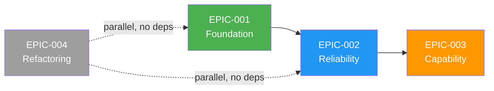

# Epics Overview — kiro.rs Fusion Blueprint

## Epic Summary

| ID | Title | Priority | Stories | Size Estimate | MVP |
|----|-------|----------|---------|---------------|-----|
| EPIC-001 | P0 Foundation | P0 — Must | 5 | XL (13 pts) | Yes |
| EPIC-002 | P1 Reliability | P1 — Must | 4 | L (10 pts) | No |
| EPIC-003 | P2 Capability Breadth | P2 — Should | 3 | M (8 pts) | No |
| EPIC-004 | Cross-version Refactoring | P2 — Should | 3 | L (9 pts) | No |

**Total**: 15 stories, ~40 story points

## Cross-Epic Dependency Map

**Key**: Solid arrows = hard dependency. Dotted = can run in parallel.

## MVP Definition

**MVP = EPIC-001 (Foundation)** delivers the three pillars that all subsequent features depend on:

- **CredentialIdentity trait** (F-008) — unified identity abstraction consumed by cache and anti-detection
- **CrossRequestCache** (F-001) — prefix cache reduces redundant token computation
- **MetricsCollector** (F-002) — observability for platform operators

### MVP Definition of Done

1. `CredentialIdentity` trait implemented with domain-separated derivation; all credential consumers use it
2. CrossRequestCache operational with LRU eviction, TTL tiers, and forced_conversation_id injection
3. MetricsCollector recording requests via ring buffer; Admin API exposing aggregation endpoints
4. All existing tests pass (`cargo test` green); new features covered by unit tests (>80% branch coverage)
5. No regression in anti-detection or compression pipelines (constraint C-001 verified)

## Recommended Execution Order

| Phase | Epic | Rationale |
|-------|------|-----------|
| Phase 1 | EPIC-001 | Foundation traits and infrastructure — everything builds on this |
| Phase 2a | EPIC-002 | Error mapping and converter hardening depend on CredentialIdentity |
| Phase 2b | EPIC-004 | Module refactoring is parallel; easier after EPIC-001 stabilizes types |
| Phase 3 | EPIC-003 | Capability features are additive; lowest risk, lowest urgency |

EPIC-004 (refactoring) can start as early as Phase 2 since it has zero functional dependencies — only structural. However, merging refactoring PRs alongside EPIC-002 feature work requires careful coordination to avoid merge conflicts.

## Traceability Matrix

| Epic | Features | Constraints | Brainstorm Decisions |
|------|----------|-------------|---------------------|
| EPIC-001 | F-008, F-001, F-002 | C-001, C-003 | PM-04 P0 grouping; SA cache-topology finding |
| EPIC-002 | F-003, F-004 | C-001, C-002 | SA error-flow-gap finding; SME compression synergy |
| EPIC-003 | F-005, F-006 | C-004 | PM dual-positioning tension; PM prompt-filter-risk |
| EPIC-004 | F-007 | C-004 | SA analysis; TS existing-coverage-baseline |

## Open Questions (Inherited)

| # | Area | Question | Impact |
|---|------|----------|--------|
| OQ-1 | Cache | Is upstream conversation_id stable across credential retries? | S-002, S-003 scope |
| OQ-2 | Security | Prompt filter TOS/detection risk | S-010 design |
| OQ-3 | Cache | CrossRequestCache insertion point: stream.rs or provider.rs? | S-003 implementation |

These MUST be resolved before the affected stories enter development.
